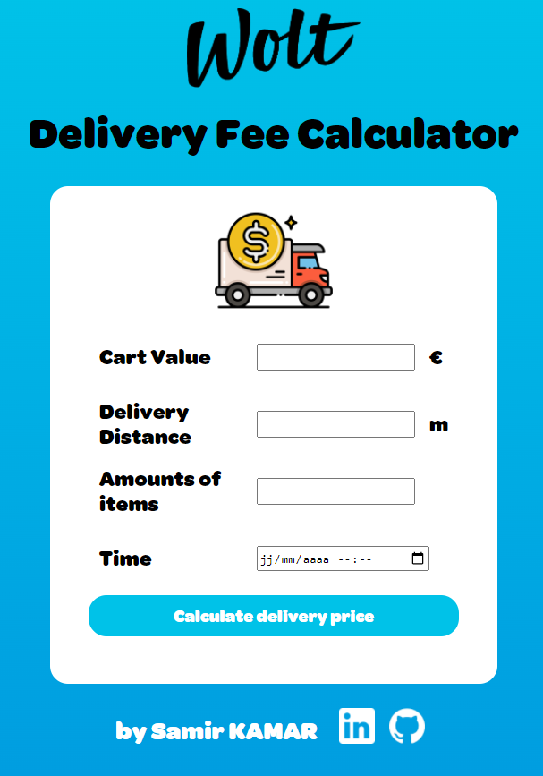

# Wolt-Delivery-Fee-Calculator-Front

## Installation and Setup Instructions

#### Example:  

Clone down this repository. You will need `node` and `npm` installed globally on your machine.  

Installation:

`npm install`  

To Start Server:

`npm start`  

To Visit App:

`localhost:3000`  

## Frontend specifics

### Your task

Mini Project for the 2022 summer internship position at Wolt, build a delivery fee calculator web app using **React and TypeScript**.

### Specification

Build a delivery fee calculator app which calculates a delivery fee based on user input and shows the calculated delivery fee to the user.

#### Input fields

| Field             | Type      | Description                                                                                             | Example value                             |
|:---               |:---       |:---                                                                                                     |:---                                       |
|Cart value         |Float      |Value of the shopping cart in euros.                                                                     |__20__                                     |
|Delivery distance  |Integer    |The distance between the store and customer’s location __in meters__.                                    |__2235__ (2235 meters = 2.235 km)          |
|Number of items    |Integer    |The __number of items__ in the customer's shopping cart.                                                 |__4__ (customer has 4 items in the cart)   |
|Order time         |Date + Time|The date/time when the order is being made (see rules-section how rush hours affect the delivery price)  |You can choose the most suitable format    |

#### Output example

